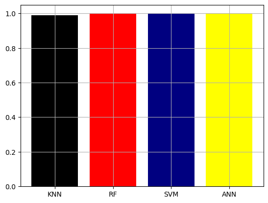
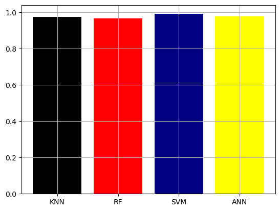

# Handwritten Digit Recognition Project with PCA

## Project Overview
This project focuses on recognizing handwritten digits using various machine learning algorithms. The dataset was obtained from the `sklearn` library. For this project, Principal Component Analysis (PCA) was used to reduce the dimensionality of the dataset to enhance the performance of the models.

## Dataset
- **Source**: `sklearn.datasets`
- **Test Size**: 30% of the dataset (`test_size=0.3`)
- **Original Attributes**: 64
- **Dimensionality Reduction**: PCA was applied to reduce the number of features from 64 to 32.

## PCA Implementation
Principal Component Analysis (PCA) was employed to reduce the dimensionality of the dataset. This technique helps in retaining most of the variance in the data while reducing the number of features. PCA was used to transform the original dataset from 64 attributes to 32 principal components for both the training and test sets.

## Algorithms Used
The following algorithms were implemented and evaluated:
- K-Nearest Neighbors (KNN)
- Random Forest
- Support Vector Machine (SVM)
- Artificial Neural Network (ANN)

## Evaluation Metrics
The models were evaluated based on the following metrics:
- **Accuracy**: Calculated for both training and test sets.
- **Precision & Recall**: Evaluated on the test set.

## Comparison and Visualization
The performance of the algorithms was compared using the following charts:

1. **Accuracy Score for Training Data**
   
   

2. **Accuracy Score for Test Data**
   
   

3. **Precision for Test Data**
   
   

4. **Recall for Test Data**
   
   

